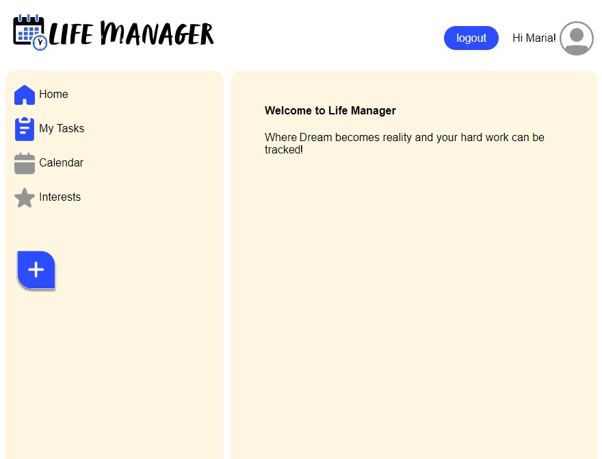

# Life Manager

## project description
LifeManager is a powerful web application designed to help users seamlessly organize their tasks and lists, whether they're for personal use or meant to be shared with others. With LifeManager, users can log in securely to create, manage, and monitor their tasks, ensuring they stay on top of their responsibilities and commitments.
## project manager & tasks
- Joel Getzke
- Marjan Nazari
- Halle Klum
## user story
 As A User…

I want to login, create and save an ordered list of tasks

So that I can manage my day to day tasks, create grocery lists, create travel itineraries, and more!

## Acceptance Criteria
```
* Use Node.js and Express.js to create a RESTful API.
* Use Handlebars.js as the template engine.
* Use MySQL and the Sequelize ORM for the database.
* Have both GET and POST routes for retrieving and adding new data.
* Use at least one new library, package, or technology that we haven’t discussed.
* Have a folder structure that meets the MVC paradigm.
* Include authentication (express-session and cookies).
* Protect API keys and sensitive information with environment variables.
* Be deployed using Heroku (with data).
* Have a polished UI.
* Be responsive.
* Be interactive (i.e., accept and respond to user input).
```
## Screenshot of the app


## links
[View deployed HEROKU app here!](https://glacial-thicket-95359-563f8150aea7.herokuapp.com/login/)


## Technologies used
- Node.js
- npm
- express
- mysql
- sequelize
- bcrypt 
- Bulma

